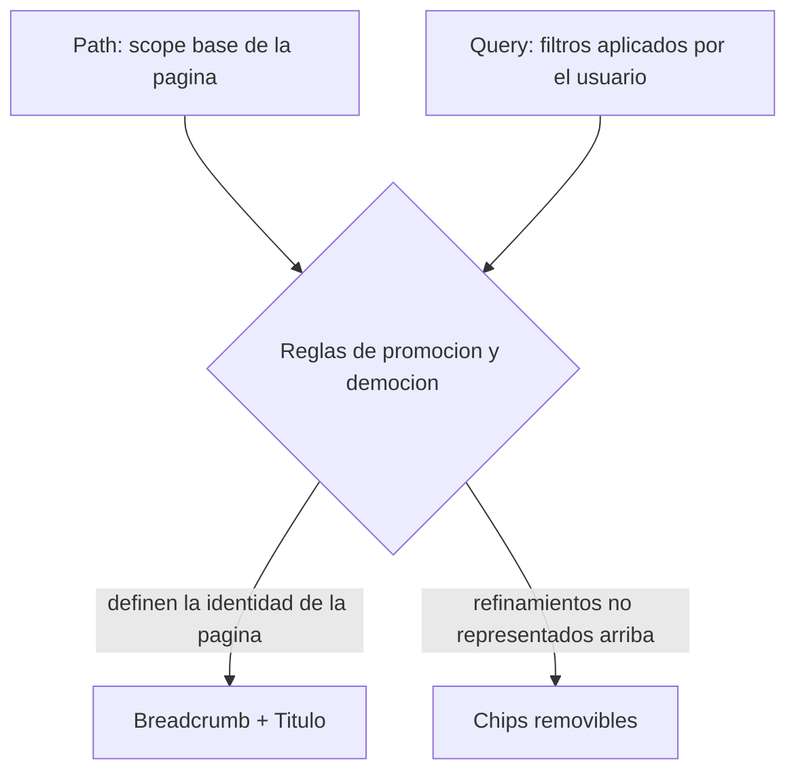
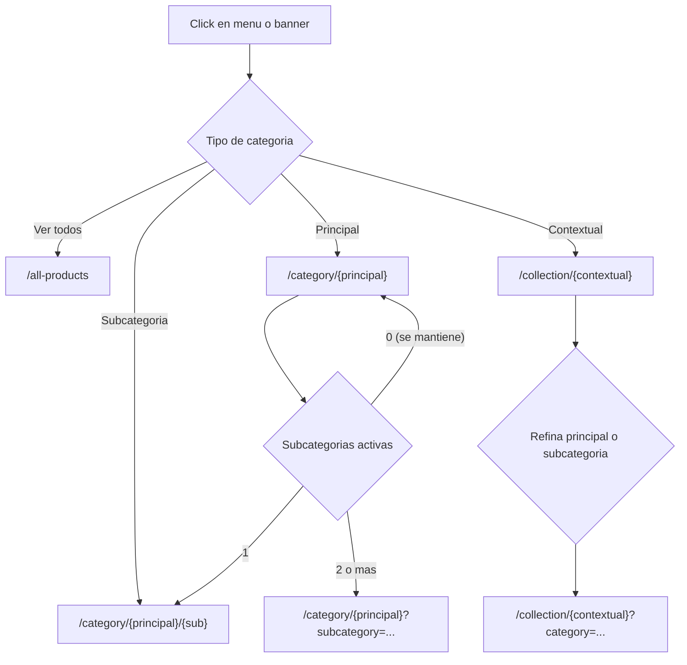

# Arquitectura de navegación y listado de productos

**Proyecto:** Formas Shop — nuevo template ecommerce  
**Versión:** 1.0  
**Estado:** Propuesta aprobada para implementación  
**Última actualización:** 2026-06-22

---

## Tabla de contenidos

1. [Resumen ejecutivo](#1-resumen-ejecutivo)
2. [Modelo de categorías](#2-modelo-de-categorías)
3. [Vistas padre](#3-vistas-padre)
4. [Arquitectura de URLs](#4-arquitectura-de-urls)
5. [Matriz de navegación](#5-matriz-de-navegación)
6. [Breadcrumb, título y chips](#6-breadcrumb-título-y-chips)
7. [Categorías contextuales en cada vista](#7-categorías-contextuales-en-cada-vista)
8. [Comportamiento del panel de filtros](#8-comportamiento-del-panel-de-filtros)
9. [Casos borde y reglas de resolución](#9-casos-borde-y-reglas-de-resolución)
10. [SEO y URLs canónicas](#10-seo-y-urls-canónicas)
11. [Glosario](#11-glosario)

---

## 1. Resumen ejecutivo

El listado de productos se organiza en **tres vistas padre**, cada una con una intención de navegación distinta:

| Vista | Ruta base | Intención del usuario |
|---|---|---|
| **Catálogo completo** | `/app/all-products` | Explorar todo el catálogo libremente |
| **Categoría principal / subcategoría** | `/app/category/{principal}` | Entrar a un universo de productos acotado por naturaleza |
| **Colección contextual** | `/app/collection/{contextual}` | Entrar a un conjunto transitorio o destacado |

### Principios de diseño

1. **Path = intención de entrada.** El segmento de ruta define el *scope* base de la página.
2. **Query = refinamiento.** Los parámetros de URL representan filtros adicionales dentro del scope.
3. **Chips = refinamientos visibles.** Todo lo que está en query y no está ya representado en path/breadcrumb/título se muestra como chip removible.
4. **Una intención única sube de nivel.** Si hay exactamente una subcategoría activa, promueve la URL a path jerárquico y actualiza breadcrumb/título.
5. **Múltiples selecciones del mismo facet vuelven al nivel padre.** Si hay dos o más subcategorías, el path se queda en la principal y las subs pasan a chips.



---

## 2. Modelo de categorías

Existen tres tipos de categoría con semánticas distintas:

### 2.1 Categoría principal

- **Pregunta que responde:** ¿Cuál es la naturaleza general del producto?
- **Ejemplos:** Drinkware, Marroquinería, Textil, Tecnología
- **Cardinalidad por producto:** exactamente **una**
- **Jerarquía:** raíz del árbol de catálogo

### 2.2 Subcategoría

- **Pregunta que responde:** ¿Qué es el producto?
- **Ejemplos:** Botella (Drinkware), Mochila (Marroquinería), Parlante (Tecnología)
- **Cardinalidad por producto:** como máximo **una**
- **Jerarquía:** hija obligatoria de una categoría principal

### 2.3 Categoría contextual

- **Pregunta que responde:** ¿A qué conjunto transitorio o destacado pertenece?
- **Ejemplos:** Día del Padre, CyberMonday, Ecológicos, Tu logo en 24 horas, Premium
- **Cardinalidad por producto:** **cero o más**
- **Jerarquía:** ninguna; es transversal a principales y subcategorías

### 2.4 Relaciones

| Relación | Cardinalidad
|---|---|
| PRINCIPAL → SUBCATEGORIA | 1:N |
| PRODUCTO → PRINCIPAL | N:1 |
| PRODUCTO → SUBCATEGORIA | N:1 |
| PRODUCTO ↔ CONTEXTUAL | N:M |

### 2.5 Lógica de filtrado

Dentro de cada *facet* (principal, subcategoría, contextual) las selecciones múltiples operan en **OR**. Entre facets distintos, la lógica es **AND**. El concepto es "Mostrame un producto solamente si cumple TODOS los filtros activos."

```
producto visible SI:
  (sin filtro principal  OR  product.principal ∈ filtros_principales)
  AND (sin filtro sub    OR  product.subcategory ∈ filtros_sub)
  AND (sin filtro ctx    OR  product.contextuals ∩ filtros_contextuales ≠ ∅)
  AND (otros filtros: precio, marca, disponibilidad, etc.)
```

---

## 3. Vistas padre

### 3.1 Catálogo completo — `/app/all-products`

| Atributo | Valor |
|---|---|
| Scope | Ninguno (catálogo entero) |
| Título H1 | **Catálogo** |
| Breadcrumb | `Todos los productos` |
| Filtros laterales | Todas las principales, subcategorías y contextuales |
| Estado en URL | Todo va en query string al filtrar |

**Ejemplos de URL:**

```
/app/all-products
/app/all-products?category=marroquineria&category=drinkware
/app/all-products?category=marroquineria&subcategory=mochilas&subcategory=bolsos
/app/all-products?contextual=ecologicos&category=textil
```

---

### 3.2 Categoría principal — `/app/category/{principal}`

| Atributo | Valor |
|---|---|
| Scope | `principal = {principal}` (fijo, no removible sin salir de la vista) |
| Título H1 | Nombre de la principal (p. ej. **Marroquinería**) |
| Breadcrumb | `Todos los productos` → `{Principal}` |
| Filtros laterales | Principal bloqueada; subs de esa principal; contextuales que intersectan |
| Salida al catálogo | Botón dedicado en filtros → `/app/all-products` |

**Ejemplos de URL:**

```
/app/category/marroquineria
/app/category/marroquineria?contextual=premium
/app/category/marroquineria?subcategory=mochilas&subcategory=bolsos
```

---

### 3.3 Subcategoría (dentro de principal) — `/app/category/{principal}/{sub}`

| Atributo | Valor |
|---|---|
| Scope | `principal = {principal}` + `subcategory = {sub}` (una sola sub en path) |
| Título H1 | Nombre de la subcategoría (p. ej. **Mochilas**) |
| Breadcrumb | `Todos los productos` → `{Principal}` → `{Sub}` |
| Filtros laterales | Igual que vista principal; sub activa preseleccionada |
| Nota | Solo aplica cuando hay **exactamente una** subcategoría activa |

**Ejemplos de URL:**

```
/app/category/marroquineria/mochilas
/app/category/marroquineria/mochilas?contextual=premium
```

---

### 3.4 Colección contextual — `/app/collection/{contextual}`

| Atributo | Valor |
|---|---|
| Scope | `contextual = {contextual}` (fijo, identidad de la página) |
| Título H1 | Nombre de la colección (p. ej. **Día del Padre**) |
| Breadcrumb | `Todos los productos` → `{Contextual}` |
| Filtros laterales | Contextual bloqueada; principales y subs con productos en la colección |
| Entrada típica | Header "Categorías", banners de home, badges en ficha de producto |

**Ejemplos de URL:**

```
/app/collection/dia-del-padre
/app/collection/ecologicos?category=marroquineria
/app/collection/ecologicos?category=marroquineria&subcategory=mochilas
```

---

## 4. Arquitectura de URLs

### 4.1 Namespaces de ruta

| Namespace | Uso | Ejemplo |
|---|---|---|
| `/app/all-products` | Exploración libre | `/app/all-products?category=textil` |
| `/app/category/{principal}` | Scope por principal | `/app/category/marroquineria` |
| `/app/category/{principal}/{sub}` | Scope por subcategoría única | `/app/category/marroquineria/mochilas` |
| `/app/collection/{contextual}` | Scope por colección | `/app/collection/cybermonday` |

> **Importante:** no usar `/app/category/{slug}` indistintamente para principal y subcategoría. Las subcategorías siempre van anidadas bajo su principal en el path.

### 4.2 Parámetros de query estándar

| Parámetro | Tipo | Descripción |
|---|---|---|
| `category` | repetible | Slug de categoría principal |
| `subcategory` | repetible | Slug de subcategoría |
| `contextual` | repetible | Slug de categoría contextual |
| `min_price` | número | Precio mínimo |
| `max_price` | número | Precio máximo |
| `brand` | repetible | Slug de marca |
| `sort` | string | Ordenamiento (`price_asc`, `newest`, etc.) |
| `page` | número | Paginación |
| `q` | string | Búsqueda por texto |

### 4.3 Promoción y democión de URL (subcategorías)

Al cambiar la selección de subcategorías en una vista de categoría principal, la URL se transforma automáticamente:

```
0 subs activas  →  /app/category/{principal}
1 sub activa    →  /app/category/{principal}/{sub}        [promoción]
2+ subs activas →  /app/category/{principal}?subcategory=… [democión]
```

**Transiciones:**

| Estado anterior | Acción del usuario | Estado resultante |
|---|---|---|
| `/category/marroquineria/mochilas` | Agrega "Bolsos" | `/category/marroquineria?subcategory=mochilas&subcategory=bolsos` |
| `/category/marroquineria?subcategory=mochilas&subcategory=bolsos` | Quita "Bolsos" | `/category/marroquineria/mochilas` |
| `/category/marroquineria?subcategory=mochilas&subcategory=bolsos` | Quita todas las subs | `/category/marroquineria` |

---

## 5. Matriz de navegación

Independientemente de la sección del header desde donde se navegue, **el tipo de categoría determina el destino**:

| Origen del click | Tipo | Destino |
|---|---|---|
| Header → Productos | Principal | `/app/category/{principal}` |
| Header → Productos | Subcategoría | `/app/category/{principal}/{sub}` |
| Header → Categorías (destacados) | Principal | `/app/category/{principal}` |
| Header → Categorías (destacados) | Subcategoría | `/app/category/{principal}/{sub}` |
| Header → Categorías (destacados) | Contextual | `/app/collection/{contextual}` |
| Header → Ver todos los productos | — | `/app/all-products` |
| Home / banner | Contextual | `/app/collection/{contextual}` |
| Ficha de producto (badge) | Contextual | `/app/collection/{contextual}` |



---

## 6. Breadcrumb, título y chips

### 6.1 Reglas generales

| Elemento | Fuente | Regla |
|---|---|---|
| **Breadcrumb** | Path + jerarquía de navegación | Refleja el nivel más alto de intención única |
| **Título H1** | Último segmento significativo del breadcrumb | Coincide con el nivel activo de intención |
| **Chips** | Query params activos | Todo lo que refina pero no define la identidad de la página |

**Lo que NUNCA va en chips:**
- La categoría principal cuando está en el path (`/category/{principal}`)
- La subcategoría cuando está en el path (`/category/{principal}/{sub}`)
- La contextual cuando está en el path (`/collection/{contextual}`)

**Lo que SÍ va en chips:**
- Subcategorías múltiples (cuando hay 2+)
- Contextuales activas como refinamiento (en vistas que no son `collection`)
- Principales y subs activas como refinamiento (en vista `collection`)
- Cualquier otro filtro (precio, marca, oferta, etc.)

---

### 6.2 Reglas por vista

#### Vista: `all-products`

```
URL base:     /app/all-products[?filtros]
Breadcrumb:   Todos los productos
Título:       Catálogo
Chips:        todas las categorías activas + otros filtros
```

**Ejemplo:**

```
URL:        /app/all-products?category=marroquineria&subcategory=mochilas&contextual=premium
Breadcrumb: Todos los productos
Título:     Catálogo
Chips:      Marroquinería × · Mochilas × · Premium ×
```

---

#### Vista: `category/{principal}` — sin subcategorías

```
URL:        /app/category/{principal}[?filtros]
Breadcrumb: Todos los productos → {Principal}
Título:     {Principal}
Chips:      contextuales + otros filtros
             (NO incluir la principal)
```

**Ejemplo:**

```
URL:        /app/category/marroquineria?contextual=premium
Breadcrumb: Todos los productos → Marroquinería
Título:     Marroquinería
Chips:      Premium ×
```

---

#### Vista: `category/{principal}` — una subcategoría (promovida a path)

```
URL:        /app/category/{principal}/{sub}[?filtros]
Breadcrumb: Todos los productos → {Principal} → {Sub}
Título:     {Sub}
Chips:      contextuales + otros filtros
             (NO incluir la sub activa)
```

**Ejemplo:**

```
URL:        /app/category/marroquineria/mochilas?contextual=premium
Breadcrumb: Todos los productos → Marroquinería → Mochilas
Título:     Mochilas
Chips:      Premium ×
```

---

#### Vista: `category/{principal}` — varias subcategorías

```
URL:        /app/category/{principal}?subcategory={a}&subcategory={b}&…
Breadcrumb: Todos los productos → {Principal}
Título:     {Principal}
Chips:      cada sub activa + contextuales + otros filtros
             (SÍ incluir todas las subs como chips removibles)
```

**Ejemplo:**

```
URL:        /app/category/marroquineria?subcategory=mochilas&subcategory=bolsos&subcategory=rinoneras&contextual=premium
Breadcrumb: Todos los productos → Marroquinería
Título:     Marroquinería
Chips:      Mochilas × · Bolsos × · Riñoneras × · Premium ×
```

> **Principio:** con varias subs la intención vuelve a ser amplia dentro de la principal ("quiero varios tipos de marroquinería"), no un tipo específico. Por eso el breadcrumb y título no bajan a nivel de subcategoría.

---

#### Vista: `collection/{contextual}`

```
URL:        /app/collection/{contextual}[?filtros]
Breadcrumb: Todos los productos → {Contextual}
Título:     {Contextual}
Chips:      principales + subs + otros filtros
             (NO incluir la contextual activa — es el scope de la página)
```

**Ejemplo:**

```
URL:        /app/collection/dia-del-padre?category=marroquineria&subcategory=mochilas
Breadcrumb: Todos los productos → Día del Padre
Título:     Día del Padre
Chips:      Marroquinería × · Mochilas ×
```

---

### 6.3 Tabla resumen breadcrumb / título / chips

| Vista | Subs activas | Breadcrumb | Título | ¿Sub en chips? | ¿Contextual en chips? |
|---|---|---|---|---|---|
| `all-products` | — | Todos los productos | Catálogo | Sí | Sí |
| `category/{p}` | 0 | …/ {P} | {P} | No | Sí |
| `category/{p}/{sub}` | 1 | …/ {P} / {S} | {S} | No | Sí |
| `category/{p}?sub=…` | 2+ | …/ {P} | {P} | Sí (todas) | Sí |
| `collection/{ctx}` | — | …/ {Ctx} | {Ctx} | Sí (si filtra) | No |

---

## 7. Categorías contextuales en cada vista

Una contextual cumple **dos roles** según el contexto:

| Rol | Descripción | Dónde aparece |
|---|---|---|
| **Scope** | Define por qué el usuario entró a la página | Path, breadcrumb, título |
| **Filtro** | Refina dentro de otra intención de navegación | Query param, chip, checkbox en sidebar |

### 7.1 Matriz de presencia

| Vista | En path | En breadcrumb | En título | En chips | En sidebar |
|---|---|---|---|---|---|
| `all-products` | — | — | — | ✓ (si filtra) | Checkbox libre |
| `category/{principal}` | — | — | — | ✓ (si filtra) | Solo las que intersectan con la principal |
| `category/{p}/{sub}` | — | — | — | ✓ (si filtra) | Solo las que intersectan |
| `collection/{contextual}` | ✓ | ✓ | ✓ | — | Locked / preseleccionada |

### 7.2 Regla de oro

```
SI la contextual define POR QUÉ entraste a la página
  → es SCOPE  → path + breadcrumb + título

SI la contextual refina DENTRO de otra intención
  → es FILTRO → query + chip
```

### 7.3 Múltiples contextuales

**En vistas de filtro** (`all-products`, `category/*`): se permiten múltiples contextuales como chips. Lógica recomendada: **OR** (productos que pertenezcan a cualquiera de las seleccionadas).

```
/app/all-products?contextual=premium&contextual=ecologicos
Chips: Premium × · Ecológicos ×
```

**En vista `collection/{ctx}`:** no se permite activar una segunda contextual como filtro. Si el usuario necesita combinar campañas, redirigir a:

```
/app/all-products?contextual={a}&contextual={b}
```

### 7.4 Superficies de acceso a contextuales

| Superficie | Comportamiento |
|---|---|
| Header → Categorías (destacados) | Link → `/app/collection/{slug}` |
| Header → Productos (árbol) | Si aparece, también → `/app/collection/{slug}` (no mezclar en jerarquía principal/sub) |
| Home / banners promocionales | Link → `/app/collection/{slug}` |
| Ficha de producto (badge) | Link → `/app/collection/{slug}` |
| Panel de filtros | Checkbox según vista y scope actual |

---

## 8. Comportamiento del panel de filtros

### 8.1 Por vista

| Vista | Principales | Subcategorías | Contextuales | Botón "Ver todos" |
|---|---|---|---|---|
| `all-products` | Todas, seleccionables | Todas, agrupadas bajo su principal | Todas | No aplica (ya está aquí) |
| `category/{p}` | Solo la activa (**locked**) | Solo de esa principal | Solo las que tienen productos de esa principal | ✓ → `/app/all-products` |
| `category/{p}/{sub}` | Locked | De esa principal; una preseleccionada | Solo las que intersectan | ✓ → `/app/all-products` |
| `collection/{ctx}` | Las que tienen productos en la colección | Las relevantes dentro de la colección | Solo la activa (**locked**) | ✓ → `/app/all-products` |

### 8.2 Facetas dinámicas

El sidebar no muestra opciones estáticas: cada facet debe calcularse según el **scope actual + filtros activos**, devolviendo solo opciones con `count > 0`.

Ejemplo en `/app/category/marroquineria`:
- Subcategorías: solo las de Marroquinería con productos
- Contextuales: solo "Premium", "Ecológicos", etc. si tienen al menos un producto de Marroquinería

### 8.3 Reactividad entre secciones (heredado del template)

Cuando el usuario selecciona una principal, las contextuales disponibles se reducen a las que intersectan. Cuando selecciona una contextual, las principales se reducen a las que tienen productos en esa colección. Ver `categories-config.js` y plan de filtros existente.

---

## 9. Casos borde y reglas de resolución

### 9.1 Acceso directo a subcategoría sin principal en URL

```
Usuario visita: /app/category/mochilas

Resolver:
  GET /api/categories/mochilas → type: subcategory, parent: marroquineria

Acción:
  301 → /app/category/marroquineria/mochilas
```

### 9.2 Filtro incompatible con el scope

```
Usuario visita: /app/category/marroquineria?subcategory=botellas
(botellas pertenece a drinkware)

Opciones (elegir una y documentar):
  A) Ignorar el parámetro incompatible (silencioso)
  B) 301 → /app/category/drinkware/botellas (redirect inteligente) ← recomendado
  C) 400 con mensaje de error
```

### 9.3 Colección contextual expirada

```
/app/collection/cybermonday-2024
ends_at < now()

Opciones:
  - 200 con listado vacío + mensaje "Esta campaña finalizó"
  - 410 Gone si la campaña no volverá
  - 301 → /app/all-products?contextual=cybermonday (si se mantiene como tag)
```

### 9.4 Colisión de slugs

Los namespaces separados (`/category/` vs `/collection/`) evitan colisiones entre una contextual "Premium" y cualquier otra entidad. Los slugs deben ser únicos en toda la tabla `categories`.

### 9.5 Link compartido con una sola sub en query (debería ser path)

```
/app/category/marroquineria?subcategory=mochilas

Acción:
  301 → /app/category/marroquineria/mochilas
```

---

## 10. SEO y URLs canónicas

### 10.1 Reglas de canonical

| URL visitada | Canonical |
|---|---|
| `/category/marroquineria?subcategory=mochilas` (1 sub) | `/category/marroquineria/mochilas` |
| `/category/marroquineria?subcategory=mochilas&subcategory=bolsos` | sí misma (ya es forma canónica para múltiples) |
| `/category/mochilas` | `/category/marroquineria/mochilas` |

### 10.2 Meta tags por vista

```html
<!-- /app/category/marroquineria/mochilas -->
<title>Mochilas | Marroquinería | Formas Shop</title>
<meta name="description" content="Mochilas personalizadas de marroquinería…" />
<link rel="canonical" href="https://formas.shop/app/category/marroquineria/mochilas" />

<!-- /app/collection/dia-del-padre -->
<title>Día del Padre | Formas Shop</title>
<meta name="description" content="Regalos corporativos para el Día del Padre…" />
<link rel="canonical" href="https://formas.shop/app/collection/dia-del-padre" />
```

### 10.3 Indexación de filtros

- **Indexar:** vistas padre, subcategoría única en path, colecciones contextuales
- **No indexar (noindex):** combinaciones con múltiples filtros activos en query (opcional, según estrategia SEO)

---

## 11. Glosario

| Término | Definición |
|---|---|
| **Vista padre** | Página de listado con un scope base definido por la ruta |
| **Scope** | Conjunto base de productos que "pertenecen" a la página antes de refinamientos |
| **Facet** | Dimensión de filtrado (principal, subcategoría, contextual, precio, marca…) |
| **Chip** | Etiqueta removible que representa un filtro activo en la UI |
| **Promoción de URL** | Pasar un filtro de query a segmento de path cuando representa intención única |
| **Democión de URL** | Bajar un filtro de path a query cuando hay múltiples selecciones del mismo facet |
| **Contextual (scope)** | La contextual es la identidad de la página (`/collection/{ctx}`) |
| **Contextual (filtro)** | La contextual refina otra vista y aparece como chip |

---

## Referencias internas

- Plan de filtros existente: `.cursor/plans/shop_categories_filter_rework_a3f08fdd.plan.md`
- Config de categorías del template: `Formas shop/modave/js/categories-config.js`
- Lógica de filtros y sync de URL: `Formas shop/modave/js/shop.js`

---

## Historial de cambios

| Versión | Fecha | Cambios |
|---|---|---|
| 1.0 | 2026-06-22 | Documento inicial con arquitectura de 3 vistas padre, reglas de URL, breadcrumb, chips y API |
| 1.1 | 2026-06-22 | Se quitaron las secciones de Modelo de datos (backend) y API de productos; el documento se enfoca en navegación, URLs y comportamiento de UI |
